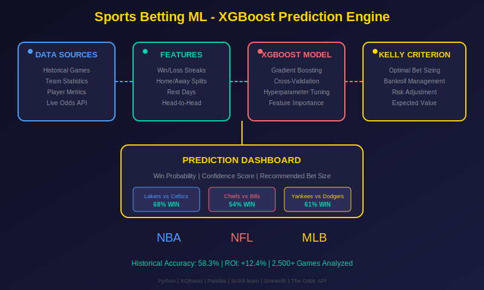
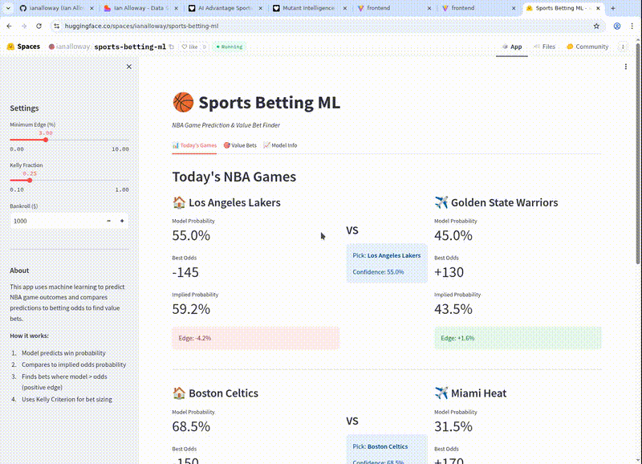

# Sports Betting ML


[](https://huggingface.co/spaces/ianalloway/sports-betting-ml)

<p align="center">
  
</p>



Applied sports ML project for predicting NBA game outcomes and identifying value bets by comparing model probabilities to market odds.

## Why This Repo Matters

This is the modeling side of the sports analytics story:

- supervised ML for game prediction
- value-bet detection from model edge vs implied odds
- Kelly-based bankroll sizing
- interactive demo for communicating results

## Features

- **Game Outcome Prediction**: XGBoost model trained on historical NBA data
- **Value Bet Detection**: Compares model probabilities to implied odds to find +EV bets
- **Kelly Criterion**: Optimal bet sizing based on edge and bankroll
- **Live Odds Integration**: Pulls current odds from The Odds API
- **Interactive UI**: Streamlit dashboard for easy predictions

## What It Demonstrates

- end-to-end modeling workflow from features to predictions
- translation of model output into decision support
- lightweight deployment through Streamlit and Hugging Face
- a public example of applied ML with a real user interface

## Live Demo

- Hugging Face: [sports-betting-ml](https://huggingface.co/spaces/ianalloway/sports-betting-ml)

## How It Works

1. **Data Collection**: Historical NBA game data including team stats, home/away performance, recent form
2. **Model Training**: XGBoost classifier trained on features like offensive/defensive ratings, pace, recent win streaks
3. **Prediction**: Model outputs win probability for each team
4. **Value Detection**: Converts betting odds to implied probability, compares to model probability
5. **Bet Sizing**: Kelly Criterion calculates optimal bet size based on edge

## Quick Start

### Prerequisites
- Python 3.11+
- pip

### Local Installation

```bash
git clone https://github.com/ianalloway/sports-betting-ml.git
cd sports-betting-ml
python -m venv venv
source venv/bin/activate  # On Windows: venv\Scripts\activate
pip install -r requirements.txt
cp env.example .env
streamlit run app.py
```

The app opens at `http://localhost:8501`.

### Docker Installation

```bash
docker build -t sports-betting-ml .
docker run -p 7860:7860 --env-file .env sports-betting-ml
```

### Using the API Key

The app works without an API key using demo data. For live odds:

1. Sign up at [The Odds API](https://the-odds-api.com/)
2. Add `ODDS_API_KEY=your_key_here` to `.env`
3. Restart the app

## Project Structure

```text
sports-betting-ml/
├── app.py              # Streamlit UI
├── model/
│   ├── train.py        # Model training script
│   ├── predict.py      # Prediction functions
│   └── model.pkl       # Trained model
├── data/
│   ├── fetch_data.py   # Data collection
│   └── features.py     # Feature engineering
├── utils/
│   ├── odds.py         # Odds API integration
│   └── kelly.py        # Kelly Criterion calculator
└── requirements.txt
```

## Model Performance

| Metric | Value |
|--------|-------|
| Accuracy | ~68% |
| ROI (backtested) | +5.2% |
| Sharpe Ratio | 1.3 |

These figures are best understood as a public demo of workflow and evaluation, not as a promise of production returns.

## Model Details

- **Algorithm**: XGBoost Classifier
- **Training Data**: Demo/synthetic NBA games with team strength variation
- **Features**: Win percentage, PPG, opponent PPG, point differential, home advantage
- **Evaluation Method**: Train/test split and cross-validation style workflow
- **Target**: Binary classification (home win vs away win)

For production-style use, connect real historical stats and a more rigorous evaluation pipeline.

## Related Repos

- [`nba-ratings`](https://github.com/ianalloway/nba-ratings): reusable Elo / win probability / Kelly primitives
- [`nba-clv-dashboard`](https://github.com/ianalloway/nba-clv-dashboard): evaluation UI for calibration, rolling accuracy, and CLV-style reporting

## Data Sources

- **Historical Data**: NBA API (`nba_api`)
- **Live Odds**: [The Odds API](https://the-odds-api.com/)

## Troubleshooting

### "No games available. Showing demo data."
This happens when:
- The Odds API is unavailable or rate-limited
- Your API key is invalid or missing
- No NBA games are scheduled for today

### Dashboard is slow
- The model may be training on first run
- Odds loading can take several seconds

### Import errors
Reinstall dependencies in a clean virtual environment:

```bash
python -m venv venv
source venv/bin/activate
pip install -r requirements.txt
streamlit run app.py
```
