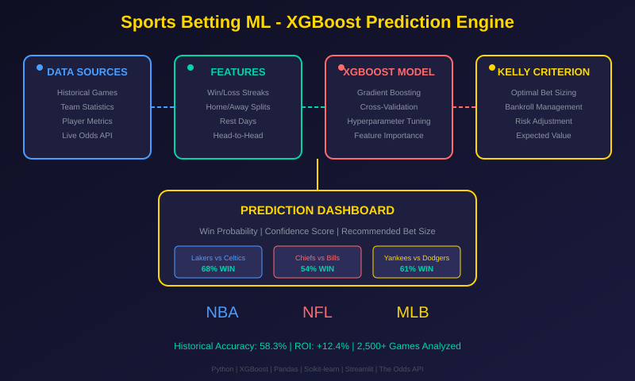
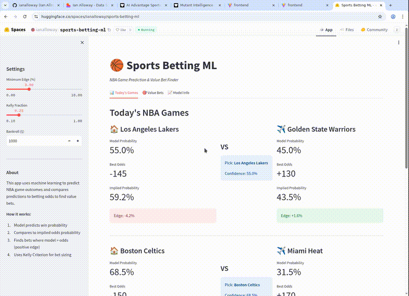

# Sports Betting ML


[](https://huggingface.co/spaces/ianalloway/sports-betting-ml)

<p align="center">
  
</p>



Applied sports ML **training demo** for predicting NBA game outcomes and identifying value bets by comparing model probabilities to market odds.

**Live demo:** [huggingface.co/spaces/ianalloway/sports-betting-ml](https://huggingface.co/spaces/ianalloway/sports-betting-ml)

**Stack layering:** [nba-ratings](https://github.com/ianalloway/nba-ratings) (Python) → [kelly-js](https://github.com/ianalloway/kelly-js) (TS) → **sports-betting-ml** (this training demo) → [ai-advantage](https://github.com/ianalloway/ai-advantage) (product).

## Why This Repo Matters

This is the modeling / demo side of the sports analytics story:

- supervised ML for game prediction
- value-bet detection from model edge vs implied odds
- Kelly-based bankroll sizing
- interactive demo for communicating results

## Features

- **Game Outcome Prediction**: XGBoost model trained on historical NBA data
- **Value Bet Detection**: Compares model probabilities to implied odds to find +EV bets
- **Kelly Criterion**: Optimal bet sizing based on edge and bankroll
- **Live Odds Integration**: Pulls current odds from The Odds API (optional)
- **Interactive UI**: Streamlit dashboard for easy predictions

## What It Demonstrates

- end-to-end modeling workflow from features to predictions
- translation of model output into decision support
- lightweight deployment through Streamlit and Hugging Face
- a public example of applied ML with a real user interface

## How It Works

1. **Data Collection**: Synthetic NBA game rows with team stats, home/away performance, recent form (`model/train.py`)
2. **Model Training**: XGBoost classifier on features like win %, PPG, opponent PPG, point differential, home advantage
3. **Prediction**: Model outputs win probability for each team
4. **Value Detection**: Converts betting odds to implied probability, compares to model probability
5. **Bet Sizing**: Kelly Criterion calculates optimal bet size based on edge

## Quick Start

### Prerequisites

- Python 3.12+
- pip
- Optional: Docker / Docker Compose for containerized runs

### Local Installation

```bash
git clone https://github.com/ianalloway/sports-betting-ml.git
cd sports-betting-ml
python -m venv venv
source venv/bin/activate  # On Windows: venv\Scripts\activate
pip install -r requirements.txt
cp env.example .env
streamlit run app.py
```

The app opens at `http://localhost:8501`.

Train a fresh model artifact (writes `model/artifacts/model.json`):

```bash
python -m model.train
```

Run the test suite / lint (same checks as CI):

```bash
pip install pytest ruff
python -m pytest tests/ -v
ruff check . --select E,F,W --ignore E501
```

### Docker

```bash
docker build -t sports-betting-ml .
docker run -p 7860:7860 --env-file .env sports-betting-ml
```

Or with Compose (app on port `7860`):

```bash
docker compose up --build
# hot-reload dev profile:
docker compose --profile dev up
```

The image entrypoint uses a mounted/CI-trained artifact when present; otherwise it trains a fallback model at startup.

### Using the API Key

The app works without an API key using demo data. For live odds:

1. Sign up at [The Odds API](https://the-odds-api.com/)
2. Add `ODDS_API_KEY=your_key_here` to `.env`
3. Restart the app

## Project Structure

```text
sports-betting-ml/
├── app.py                 # Streamlit UI
├── model/
│   ├── train.py           # Synthetic data + training / evaluation
│   ├── predict.py         # Prediction helpers
│   └── artifacts/         # model.json (generated; not committed)
├── data/
│   └── features.py        # Feature engineering
├── utils/
│   ├── odds.py            # Odds API integration
│   └── kelly.py           # Kelly Criterion calculator
├── docker/
│   └── entrypoint.sh      # Container start + optional train
├── docs/
│   └── architecture.svg
├── tests/                 # pytest suite
├── docker-compose.yml
├── Dockerfile
├── env.example
└── requirements.txt
```

## Model Performance (synthetic demo)

> **Honesty note:** figures below come from a local run of `python -m model.train` on the **synthetic** sample generator. They illustrate the evaluation workflow only — not live market performance, bankroll growth, or production ROI. The training script does **not** compute betting ROI or Sharpe; older README / UI numbers that claimed those were illustrative placeholders and have been removed.

| Metric | Typical synthetic value |
|--------|-------------------------|
| Walk-forward CV accuracy | ~0.58 |
| Chronological holdout accuracy | ~0.61 |
| Holdout log loss | ~0.67 |
| Holdout Brier score | ~0.24 |

Re-run `python -m model.train` to regenerate metrics for your machine; synthetic draws vary slightly by seed / environment.

## Model Details

- **Algorithm**: XGBoost Classifier
- **Training Data**: Demo/synthetic NBA games with team strength variation (`model/train.py`)
- **Features**: Win percentage, PPG, opponent PPG, point differential, home advantage
- **Evaluation Method**: Walk-forward CV and chronological holdout (see `model/train.py`)
- **Target**: Binary classification (home win vs away win)
- **Artifact**: `model/artifacts/model.json` (XGBoost native format; created by training / CI, not checked in)

For production-style use, connect real historical stats and a more rigorous evaluation pipeline. There is currently no `nba_api` fetch module in this repository.

## Related Repos

- [`nba-ratings`](https://github.com/ianalloway/nba-ratings): reusable Elo / win probability / Kelly primitives (PyPI: `nba-edge`)
- [`kelly-js`](https://github.com/ianalloway/kelly-js): TypeScript Kelly / odds / bankroll math
- [`ai-advantage`](https://github.com/ianalloway/ai-advantage): live product layer at [aiadvantagesports.com](https://aiadvantagesports.com)

Archived evaluation UI (read-only): [`nba-clv-dashboard`](https://github.com/ianalloway/nba-clv-dashboard) — prefer the living stack above for new work.

## Data Sources

- **Training data**: Synthetic sample games generated in `model/train.py`
- **Live Odds**: [The Odds API](https://the-odds-api.com/) (optional; demo odds if `ODDS_API_KEY` is unset)

## Troubleshooting

### "No games available. Showing demo data."

This happens when:

- The Odds API is unavailable or rate-limited
- Your API key is invalid or missing
- No NBA games are scheduled for today

### Dashboard is slow

- First run may train a fallback model if no artifact is present
- Odds loading can take several seconds

### Import errors

Reinstall dependencies in a clean virtual environment:

```bash
python -m venv venv
source venv/bin/activate
pip install -r requirements.txt
streamlit run app.py
```

## License

MIT — see [LICENSE](LICENSE).
